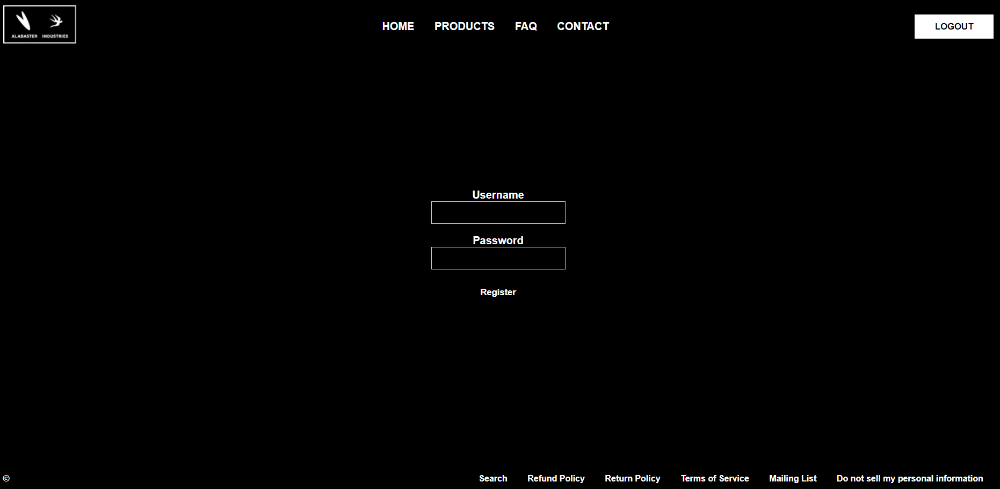
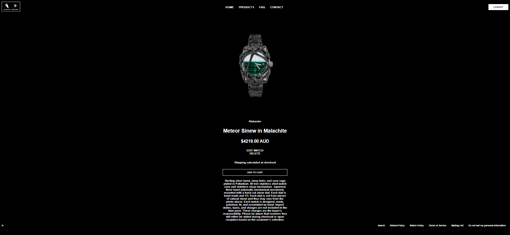
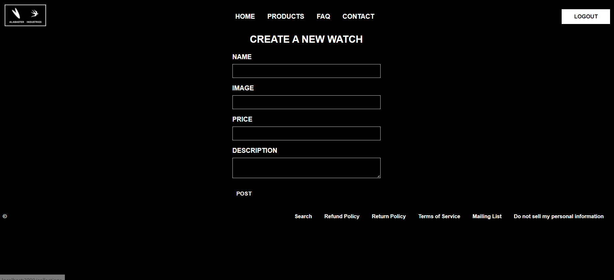
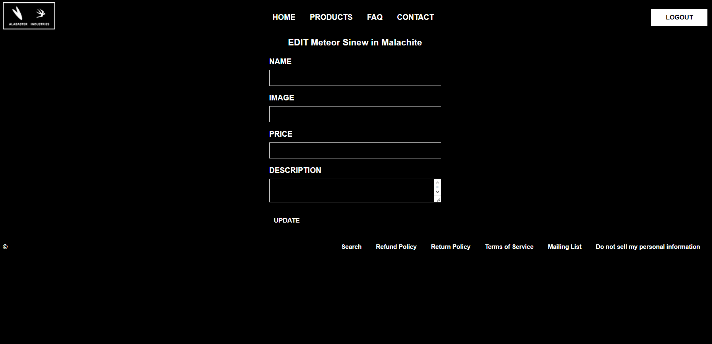

# Alabaster Industries Alternative

This application is an alternative site to alabaster.industries. It is a multi-page CRUD app made using Express and NodeJS. It is styled different to the original website but has added features for the administrators to post/edit and delete products. It also has a sign-up feature for new users to view the site. The site was designed in a way that it would be a permium, invite-only site, thus the site's layout and design.

To view CRUD utilities, please log into the website with username: 'admin' and password: 'root'.

### Deployed App

[Deployed Ver.](https://alabaster-alt.onrender.com)

## Screenshots

## Technologies Used

- express
- ejs
- express-ejs-layouts
- express-session
- method-override
- dotenv
- pg
- bcrypt
- HTML
- CSS
- JS
- Node
- PostgreSQL

### Project Board

[Project Board](https://imgur.com/a/kRkx1BL)

## Next Steps

### Planned Future Enhancements

1. [Style the CSS better, have better naming]
2. [Add new routes that mimic the actual site]
3. [Add a profile page for the administrator for ease of access]
